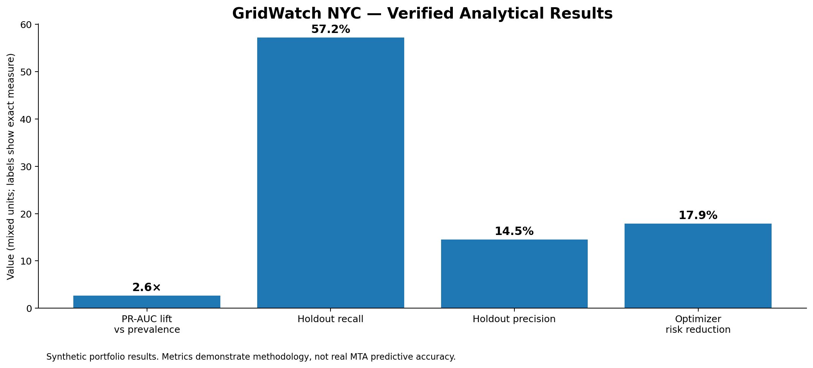
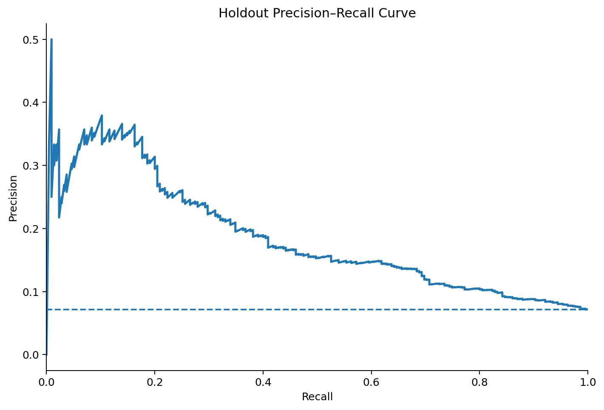
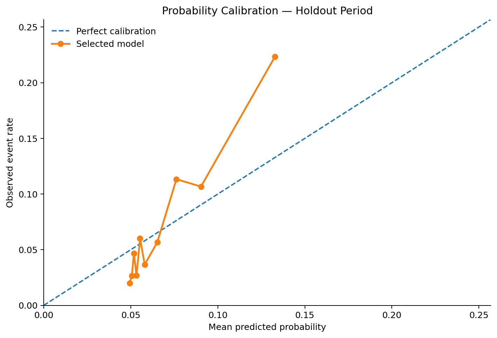
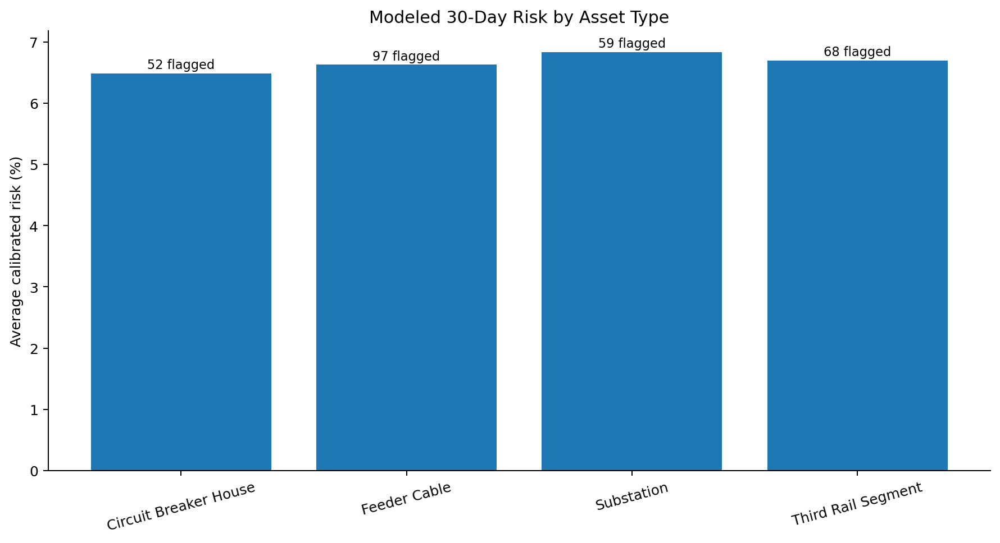

# GridWatch NYC
### Predictive Maintenance • Reliability Analytics • Optimization • Scenario Planning

**GridWatch NYC** is an end-to-end operations analytics and decision-support system for a synthetic urban rail power-asset portfolio. It goes beyond descriptive BI by connecting **longitudinal feature engineering, rare-event predictive modeling, probability calibration, advanced SQL, constrained maintenance optimization, capacity stress testing, and automated data-quality controls** in one reproducible workflow.

> **Portfolio disclosure:** All operational records are synthetic and generated for demonstration. This project is not affiliated with the MTA and contains no confidential or internal agency information.



## Executive snapshot

| Verified result | Final run |
|---|---:|
| Asset-month modeling observations | **31,000** |
| Training / validation / holdout | **24,000 / 4,000 / 3,000** |
| Selected model | **HistGradientBoosting** |
| Holdout PR-AUC | **0.188** |
| Prevalence baseline PR-AUC | **0.072** |
| PR-AUC lift over baseline | **2.6×** |
| Holdout ROC-AUC | **0.712** |
| Recall at frozen threshold | **57.2%** |
| Precision at frozen threshold | **14.5%** |
| Optimizer status | **Optimal** |
| Unresolved weighted-priority reduction vs heuristic | **17.9%** |
| Automated tests | **12 passed** |
| Data-quality controls | **15/15 passed** |

*These are synthetic scenario results, not claims about real MTA assets or production performance.*

## The management problem

A maintenance organization does not only need to know **what happened**. It must decide **what to do next**:

- Which assets deserve attention before they generate corrective work?
- How should rare-event risk be evaluated without relying on misleading accuracy?
- Which work orders should be scheduled when labor hours and technician skills are constrained?
- How much residual operational risk remains if staffing capacity changes?
- Can the analytical pipeline be explained, reproduced, and audited?

GridWatch was designed around those questions.

## Decision architecture

```text
Assets + Inspections + Incidents + Work Orders + Technicians
                            │
                            ▼
                   Data-Quality Controls
                            │
                            ▼
            Leakage-Controlled Asset-Month Snapshots
                            │
                            ▼
             30-Day Corrective-Maintenance Risk
       Logistic Regression ↔ HistGradientBoosting
             temporal validation + calibration
                            │
             ┌──────────────┴──────────────┐
             ▼                             ▼
      Asset Intelligence             Priority Engine
   condition / incidents /       risk / SLA / criticality /
    maintenance history           condition deterioration
             │                             │
             └──────────────┬──────────────┘
                            ▼
                Constrained Optimization
              skills + labor-hour capacity
                            │
                            ▼
                  Scenario Planning Lab
               50%–120% capacity stress test
                            │
                            ▼
                 Streamlit Command Center
```

## Why this is more than a dashboard

### 1. Longitudinal, leakage-controlled feature engineering
The model uses **31,000 monthly asset snapshots**, not one static row per asset. Every feature is constructed only from information available on or before the snapshot date. The target asks whether a **corrective work order is created in the following 30 days**.

This demonstrates rolling-window analysis, maintenance-history features, inspection trends, incident/downtime aggregation, and explicit prevention of future-information leakage.

### 2. Temporal validation instead of a random split
The workflow uses chronological partitions:

- **Training:** through 2025-12-31
- **Validation / calibration:** 2026-01-01 through 2026-04-30
- **Untouched holdout:** beginning 2026-05-01

The operating threshold is selected on validation data and frozen before holdout evaluation.



### 3. Rare-event evaluation + probability calibration
Corrective maintenance is a relatively rare event, so the project emphasizes **PR-AUC, recall, precision, ROC-AUC, F1, Brier score, calibration, and confusion-matrix behavior** instead of headline accuracy.



### 4. Explainable asset intelligence
The application combines modeled risk with transparent operational contributors: condition deterioration, inspection decline, recent incidents, repeat failures, maintenance interval, open critical work, and asset criticality.

These are labeled **decision-support contributors**, not causal explanations or fabricated SHAP values.



### 5. Mathematical maintenance optimization
Open work is not merely sorted by a score. Technician scheduling is formulated as a **mixed-integer optimization problem** with skill compatibility, labor-hour capacity, estimated job duration, operational priority, and one-assignment-per-job constraints.

The optimized plan is evaluated against a transparent priority/SLA heuristic under the **same capacity constraints**.

### 6. Scenario + resource planning
The Scenario Planning Lab lets a manager change modeled-risk weight, SLA/backlog urgency, asset criticality, condition deterioration, total maintenance capacity, and jobs considered. It compares **risk-first, SLA-first, and optimized strategies** and stress-tests capacity from **50% to 120%**.

### 7. Production-minded analytical controls
Automated validation checks cover uniqueness, referential integrity, valid ranges, work-order date logic, null feature control, binary targets, technician capacity, and aged-backlog realism. The final pipeline passed **15/15 data-quality checks** and **12 automated tests**.

## Professional data-analysis skills demonstrated

| Skill area | Evidence |
|---|---|
| **Python / pandas / NumPy** | reproducible pipeline, time-aware transformations, longitudinal feature engineering |
| **Advanced SQL** | normalized schema, CTEs, joins, window functions, rolling analysis, SLA aging, DQ queries |
| **Predictive analytics** | logistic benchmark + gradient-boosting challenger for rare-event classification |
| **Model validation** | temporal holdout, calibration, frozen threshold, PR-AUC/ROC-AUC/Brier/precision/recall |
| **Operations research** | mixed-integer scheduling under technician-skill and labor constraints |
| **Scenario analysis** | strategy comparison + 50%–120% staffing-capacity stress test |
| **Data quality** | referential integrity, range/date controls, freshness and backtesting boundaries |
| **Visualization** | Streamlit + Plotly manager-facing decision application |
| **Business analysis** | risk queue, SLA exposure, maintenance prioritization, residual-risk trade-offs |
| **Governance / documentation** | architecture, methodology, data dictionary, model card, explicit limitations |

## Dashboard modules

**Command Center** — Executive action brief, risk queue, backlog exposure, and portfolio-level decision signals.

**Asset Intelligence** — Asset risk, transparent contributors, inspection history, incidents, and work-order history.

**Maintenance Optimizer** — Baseline-vs-optimized scheduling, technician assignments, utilization, and solver status.

**Scenario Planning** — Interactive resource assumptions, strategy comparison, residual-risk analysis, and capacity stress testing.

**Model Validation** — Temporal split design, model comparison, precision–recall analysis, calibration, confusion matrix, and predictive signals.

**Data Quality** — Automated controls, lineage, freshness, backtesting boundaries, and production-governance limitations.

## Repository structure

```text
GridWatch_NYC/
├── app/                         # Streamlit decision-support application
├── data/
│   ├── raw/                     # synthetic operational histories
│   └── processed/               # snapshots, risk scores, schedules, drivers
├── docs/                        # architecture, methodology, model card, dictionary
├── reports/
│   ├── figures/                 # portfolio / README visuals
│   ├── model_metrics_v3.json
│   ├── data_quality_report.json
│   └── schedule_comparison.json
├── sql/                         # schema + analytical + data-quality SQL
├── src/
│   ├── data_generation/
│   ├── features/
│   ├── modeling/
│   ├── optimization/
│   └── validation/
├── tests/
├── requirements.txt
└── run_pipeline_final.py
```

## Reproduce the full pipeline

```bash
python -m pip install -r requirements.txt
python run_pipeline_final.py
python -m streamlit run app/app.py
```

## 30-second interview explanation

> I built GridWatch as an operations decision-support system rather than a reporting dashboard. I modeled asset behavior longitudinally, prevented future-data leakage, evaluated rare-event predictions on a chronological holdout, calibrated probabilities, converted reliability signals into an auditable maintenance-priority framework, optimized technician assignments under skill and labor constraints, and stress-tested how staffing capacity changes residual operational risk. I also added automated data-quality controls and model documentation so the analytical outputs are reproducible and reviewable.

## Technical documentation

- [Architecture](docs/architecture.md)
- [Methodology](docs/methodology.md)
- [Data dictionary](docs/data_dictionary.md)
- [Model card](docs/model_card.md)
- [Advanced SQL analysis](sql/analytics.sql)
- [SQL data-quality checks](sql/data_quality.sql)

## Limitations and responsible use

GridWatch uses synthetic data to demonstrate analytical design and engineering depth. The reported model metrics and optimization impact **must not be interpreted as real MTA performance**. A production implementation would require validated internal data, domain-engineer review, safety governance, access controls, model monitoring, audit logging, change management, and approved operating thresholds.
